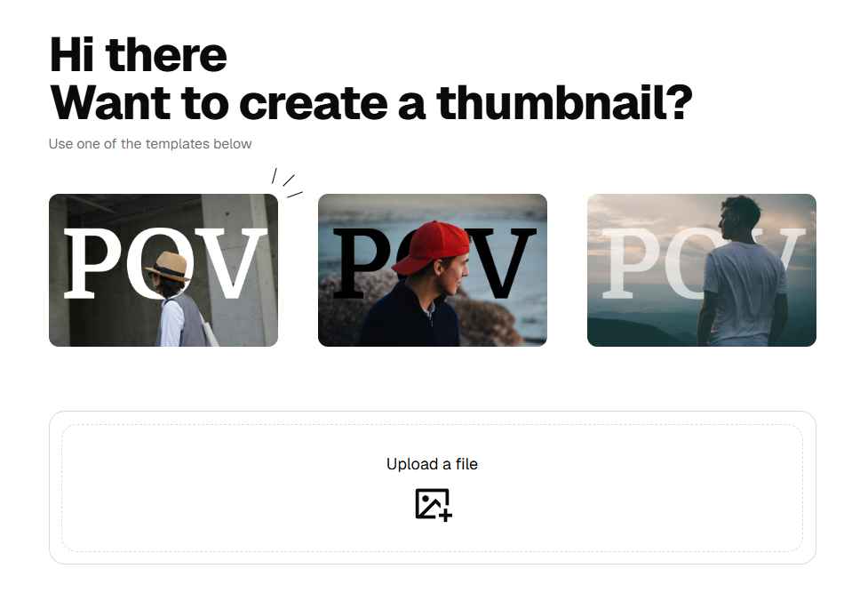

<h1 align="center">Thumbnail SaaS 📸</h1>



## Demo:
https://thumbnailsgen.vercel.app/

## Overview

**Easier thumbnails for creators**  

Creating thumbnails with text behind the foreground is a popular style, but it can be time-consuming to make manually. This tool lets you **generate them automatically**, saving time while producing professional-looking thumbnails for videos, blogs, and social media posts.


## About This Project
- ⚛️ Tech Stack: Next.js, Tailwind CSS, ShadCN UI, PostgreSQL (Prisma ORM), NextAuth, AWS S3, Stripe, @imgly/background-removal

- 🤖 AI Background Removal  
- 🖼 Thumbnail Templates  
- 🪣 S3 Bucket Integration  
- 💳 Stripe Integration  
- 💰 Credit System  
- 📤 Image Uploader  
- 🔑 Sign Up / Sign In  
- ✨ Sleek Landing Page  
- 🚀 Vercel Deployment  
- 📊 PostgreSQL Database  


## Setup

### Clone the repository
```bash
git clone https://github.com/letbrocode/thumbnail-saas.git 
cd thumbnail-saas
```

### Install dependencies
```bash
npm install
```

### Setup environment variables
Create a `.env` file in the root and add the necessary environment variables from `env.js`.

### Run the project
```bash
npm run dev
```

### Access the application
Open your browser and visit: [http://localhost:3000](http://localhost:3000)
